  

  

  
  
  

  
  
  

---

### Sobre mim

Comecei em UI/UX Design e migrei para engenharia — hoje projeto a interface no Figma
já pensando na arquitetura do código. Entrego **sites e aplicações web completas**:
landing pages, sites institucionais, e-commerce, dashboards e SaaS — sempre com
deploy real em produção (Cloudflare, Vercel).

Quando o produto pede, também construo a camada de **IA**: agentes, RAG e avaliação
automatizada. Mas o dia a dia é desenvolvimento web full-stack — a IA é uma
ferramenta a mais, não um pré-requisito.

Procuro **vagas e projetos no Brasil, Portugal e Espanha** — remoto, full-time,
CLT/PJ ou contrato por projeto.

---

### 💻 O que entrego

- **Sites institucionais e landing pages** focados em conversão (Astro, HTML/CSS, Cloudflare Pages)
- **Aplicações web e SaaS** com autenticação, banco e painel admin (Next.js, React, Hono, Drizzle + Neon Postgres)
- **E-commerce e catálogos digitais**
- **Design + implementação**: do wireframe no Figma ao deploy, sem repassar para terceiros
- **Camada de IA opcional**: agentes, RAG e automações quando fazem sentido para o produto

---

### 🤖 IA — capacidade extra

| Área | O que faço |
|---|---|
| **Agentes** | Arquiteturas em LangGraph com ciclo `planner → executor → judge → synthesizer`, tool-calling, retry por avaliação |
| **RAG** | ChromaDB, embeddings com `sentence-transformers`, chunking e retrieval, indexação de bases próprias |
| **Avaliação** | LLM-as-judge, evals automatizados (validação de schema JSON, keywords, tamanho), loops de correção |
| **Orquestração multi-agente** | FastAPI + `litellm`, papéis especializados (DEV, QA, SEO, Security…), RAG sobre execuções passadas |
| **Modelos** | Ollama (local — llama3.2), Google Gemini (`@google/genai`), roteamento multi-provider via litellm |

> Nível honesto: **aplicação de LLM em produto**, não pesquisa nem treino de modelos do zero.

---

### 🛠️ Stack

**Linguagens**

**Front-end**

**Back-end**

**IA**

**Infra & Dados**

**Design**

---

### 🚀 Projetos

| Projeto | Descrição | Stack | Link |
|---|---|---|---|
| **Alide Psicologia** | Site de conversão para psicóloga: jornada estruturada até o agendamento | HTML · CSS · Cloudflare Pages | [ao vivo](https://alidepsicologia.pages.dev/) |
| **Portfólio** | Astro SSR com painel admin (auth próprio) para projetos, depoimentos e certificados | Astro · Cloudflare Workers · Neon Postgres | [ao vivo](https://gustavochiposchepedro.gcpdev.workers.dev) |
| **Cachaçaria do Estevão** | Catálogo digital para adega / coleção de destilados | HTML · CSS · JS | [ao vivo](https://adega-do-estevao.pages.dev) |
| **Tarsier** | Plataforma de monitoramento de sites (uptime, SSL, analytics via snippet, alertas), estilo PostHog | Cloudflare Workers + Cron · Next.js · Drizzle · Neon | em desenvolvimento |
| **Agência de IA** | Plataforma de orquestração multi-agente com RAG e sistema de evals | FastAPI · litellm · Gemini · Redis · Postgres · Docker | em desenvolvimento |
| **Atalaia** | Geração de leads com auditoria automática de site e outreach personalizado | Next.js 15 · Drizzle · Neon · fila de jobs | em desenvolvimento |

---

### 📊 GitHub

  
  

  

---

### 💼 Para recrutadores e empresas

- **Mercados:** Brasil · Portugal · Espanha
- **Disponibilidade:** full-time remoto · CLT/PJ · contrato por projeto
- **Fuso:** UTC-3 (Brasil) — sobreposição confortável com Portugal e Espanha (manhã/tarde)
- **Idiomas:** Português (nativo) · Espanhol · Inglês (intermediário, evoluindo)
- **O que entrego:** sites e aplicações web completas — do wireframe no Figma ao deploy — com IA quando o produto pede
- **Portfólio:** https://gustavochiposchepedro.gcpdev.workers.dev · **Repositórios:** https://github.com/Chiposche?tab=repositories

  
  
  

---

<em>Transformando ideias complexas em produtos funcionais — do pixel ao deploy.</em>

